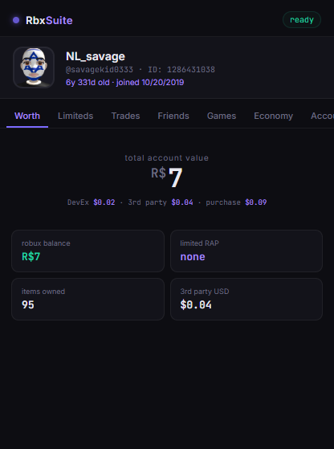
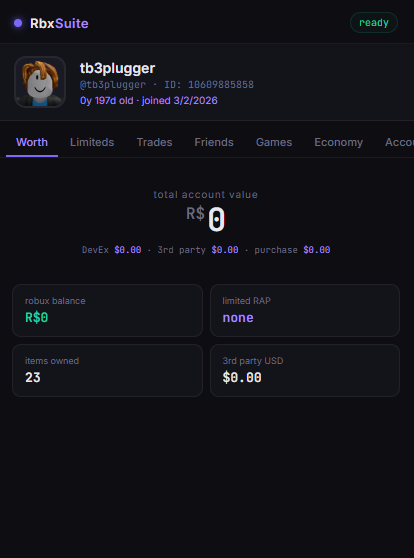
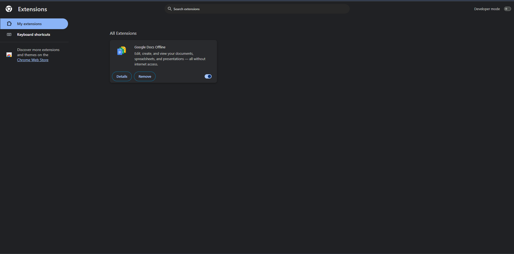
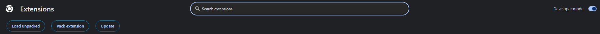
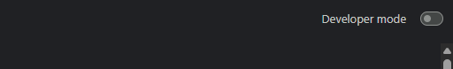
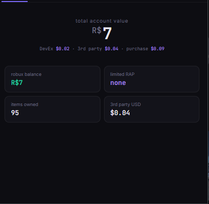
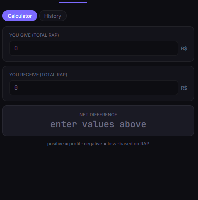
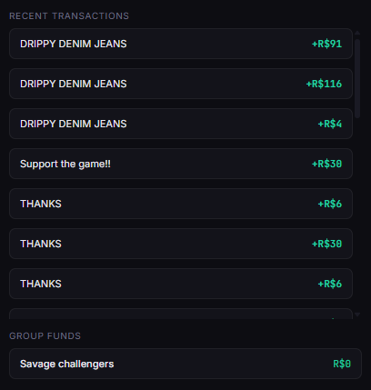

<div align="center">

# 🎮 RbxSuite

**The all-in-one Roblox account summary extension for Chrome**



[](https://github.com/YOUR_USERNAME/RbxSuite/releases)
[]()
[]()

</div>

---

## ✨ Features

- 💰 **Worth** — Total account value, Robux balance, limited RAP, 3rd party USD estimate
- 🎁 **Limiteds** — All limited items + clothing inventory with RAP values
- 🔄 **Trades** — Trade calculator (profit/loss) + full trade history
- 👥 **Friends** — Online friends, friend requests, unfollower tracker
- 🎮 **Games** — Recently played + favorite games
- 📊 **Economy** — Recent transactions + group funds
- 📋 **Account** — Username history

---

## 📥 How to Install

> ⚠️ RbxSuite is not on the Chrome Web Store yet. Installation takes **under 2 minutes!**

### 1️⃣ Download the latest release

Go to the [**Releases**](https://github.com/rblxsuite/rblxsuitex/releases/tag/v2.0)) tab → download the `.zip` file



### 2️⃣ Unzip it

Right click the `.zip` → **Extract All** → pick a folder you'll remember

### 3️⃣ Open Chrome Extensions

Type the following in your Chrome address bar and press Enter:

```
chrome://extensions
```



### 4️⃣ Turn on Developer Mode

Toggle **Developer Mode** in the **top right corner**



### 5️⃣ Load RbxSuite

Click **Load unpacked** → find the folder you unzipped → click **Select Folder**



### 6️⃣ Done! 🎉

RbxSuite will appear in your Chrome toolbar. Click it on any Roblox page!

> 💡 Don't see the icon? Click the 🧩 puzzle piece in your toolbar and **pin** RbxSuite

---

## 🖼️ Preview

| Worth | Trades | Economy |
|-------|--------|---------|
|  |  |  |

---

## ❓ FAQ

<details>
<summary><b>Extension disappeared after restarting Chrome?</b></summary>
Go to `chrome://extensions` and toggle RbxSuite back ON.
</details>

<details>
<summary><b>Icon not showing in toolbar?</b></summary>
Click the 🧩 puzzle piece → find RbxSuite → click the 📌 pin.
</details>

<details>
<summary><b>"This extension is not from the Chrome Web Store"?</b></summary>
Normal for unpacked extensions. Click Keep or dismiss — RbxSuite is safe and open source.
</details>

<details>
<summary><b>Does RbxSuite steal my account?</b></summary>
No. RbxSuite only reads your Roblox data to display it in the popup. Source code is fully open for inspection.
</details>

---

## 🐛 Found a bug?

Open an [**Issue**](https://github.com/YOUR_USERNAME/RbxSuite/issues) and describe what happened!

---

## ⭐ Support

If RbxSuite helps you out, drop a star on the repo — it helps a lot! 🙏

---

<div align="center">
<i>Not affiliated with Roblox Corporation.</i>
</div>
